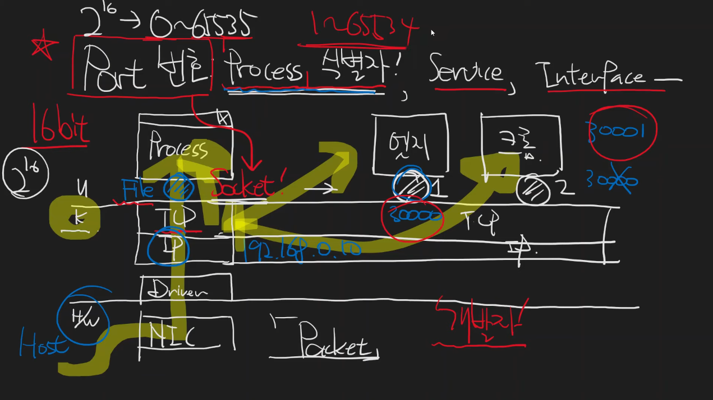

# port 번호 
    커널에 연결된 소켓을 생성할때 TCP 소켓으로 생성하면 그 중에 attach되는 정보중 하나가 port 번호

    16비트로 이루어짐
    == 경우의 수 2^16 == 0~65535
    하지만 0, 65535는 안씀

    IP주소가 192.168.0.10일 경우
    user계층에서 프로그램 2개 실행
    각각의 port번호는 같지 않음
    == 프로세스 식별자

