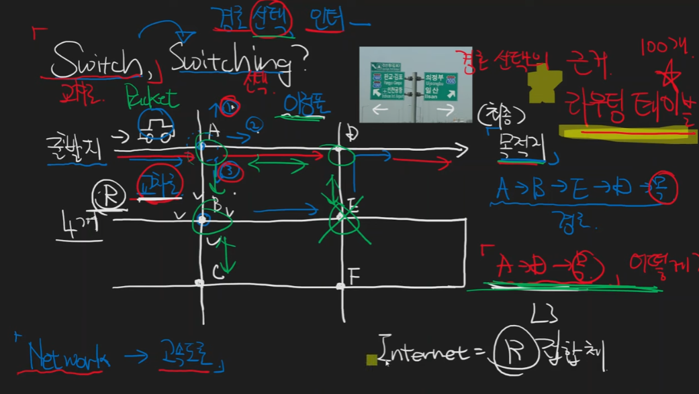

# network = 고속도로

# swich = 교차로
    경로 = 인터페이스
    선택 = switching

    최적화된 경로를 찾아내는것이 중요
    internet = router 집합체 = L3 switching
    교차로 = router
    router 끼리 통신해서 최적화된 경로 결정
    한개의 router가 손상되어도 네트워크 전체가 망가지지 않음
    자동차 = packet
    이정표 = routing table = 의사결정 기준

    