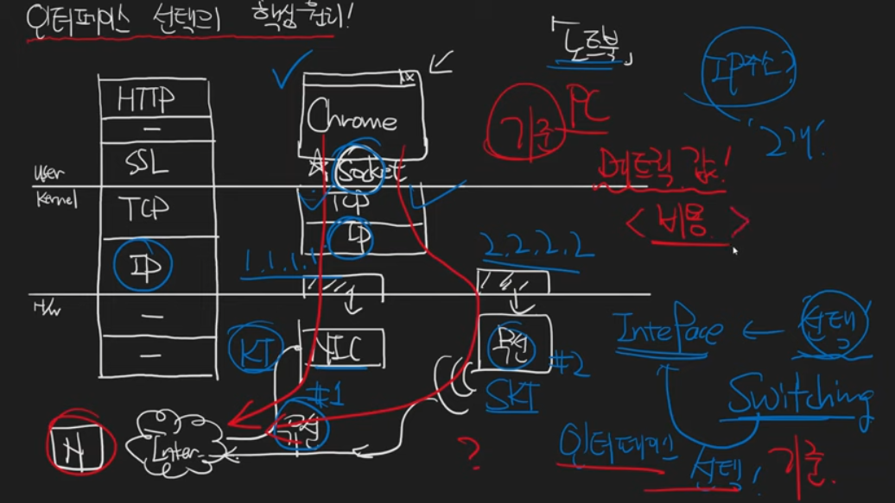

# 유선과 무선의 인터페이스가 다를때 어떤 기준으로 선택할까
    PC = 메트릭 값 (비용)

# 메트릭
    라우팅 메트릭   
        경로의 비용을 나타내는 수치

    네트워크 성능 메트릭
        성능을 평가하는 수치

## 라우팅 메트릭
    홉 카운트 (Hop Count) - RIP
        경로 상에 있는 중간 라우터의 수

    비용 (Cost) - OSPF, IS-IS
        각 링크에 할당된 가상의 비용
        다양한 요소를 기반으로 계산

    복합 메트릭 (Composite Metric) - EIGRP
        대역폭, 지연 시간, 신뢰성, 그리고 부하 등 여러 요소를 종합적으로 고려

        대역폭 - 비용을 계산하는 기반
            네트워크 링크의 전송 용량
            높은 대역폭이 선호됨

        지연 시간
            데이터 패킷이 소스에서 목적지까지 전달되는 데 걸리는 시간

        신뢰성
            링크의 오류율이나 연결의 안정성
            높은 신뢰성 선호
    
    로컬 프리퍼런스 (Local Preference) - BGP
        트래픽의 흐름을 제어하고, 특정 경로를 사용하도록 설정하는 데 사용

    AS (자율 시스템) 경로 길이 - BGP
        데이터 패킷이 통과해야 하는 AS의 개수

    MED (Multi-Exit Discriminator) - BGP
        AS간 경로 비교를 위한 속성, 같은 인접 AS에서 수신된 라우트를 비교할 때 사용

## 라우팅 프로토콜
    네트워크 내에서 라우터 간의 정보 교환 및 경로 선택을 위한 규약

    RIP (Routing Information Protocol): 거리 벡터 라우팅 프로토콜의 한 종류로, 홉 카운트를 메트릭으로 사용. 
        간단한 구조와 설정이 장점, 홉 카운트의 최대값이 15로 제한되어 큰 네트워크에는 적합하지 않음.
        간단한 네트워크 구성이 필요한 기업, 교육 기관 등에서 사용

    OSPF (Open Shortest Path First): 링크 상태 라우팅 프로토콜의 한 종류, 라우터 간의 링크 정보를 공유하여 
        네트워크 내의 최단 경로를 계산. 대역폭을 메트릭으로 사용하며, 대규모 네트워크에서 안정적이고 확장성이 좋음.
        통신사, 대형 기업, 정부 기관 등에서 주로 사용

    EIGRP (Enhanced Interior Gateway Routing Protocol): Cisco에서 개발한 고급 거리 벡터 라우팅 프로토콜, 
        복잡한 메트릭을 사용해 더욱 정확한 경로 선택이 가능. 빠른 수렴 속도와 확장성이 좋으나, 주로 Cisco 장비에서 사용.
        중소형 기업, 캠퍼스 네트워크, 지점 간 연결 등 다양한 규모의 네트워크에서 활용

    IS-IS (Intermediate System to Intermediate System): 링크 상태 라우팅 프로토콜의 한 종류, 
        OSPF와 유사한 방식으로 작동. 주로 대규모 네트워크와 특히 텔레콤 회사에서 사용, 계층적 구조를 가지고 있어 확장성이 좋음.
        인터넷 백본 네트워크

    BGP (Border Gateway Protocol): AS(Autonomous System) 간의 라우팅 정보를 교환하기 위한 경로 벡터 프로토콜. 
        인터넷 백본에서 사용되며, 글로벌 라우팅 테이블을 통해 다양한 네트워크 간 연결을 관리.
        인터넷 서비스 제공자(ISP)와 대규모 네트워크를 운영하는 기관에서 주로 사용

### 인터넷 백본 네트워크
    인터넷 백본 네트워크는 인터넷의 기반이 되는 고속, 고용량의 중추적인 네트워크를 의미
    전 세계적으로 연결된 이 백본 네트워크를 통해 국가 간, 대륙 간의 데이터 교환이 이루어지며, 
    사용자들이 인터넷을 통해 웹 사이트 접속, 파일 다운로드, 스트리밍 서비스 등 다양한 활동을 할 수 있음

    광섬유 케이블을 통해 고속의 데이터 전송을 지원하며, 서로 다른 네트워크를 연결하는 핵심 인프라 역할을 함
    ISP(Internet Service Provider, 인터넷 서비스 제공자)들, 대형 통신사들, 정부 기관 등이 소유

    