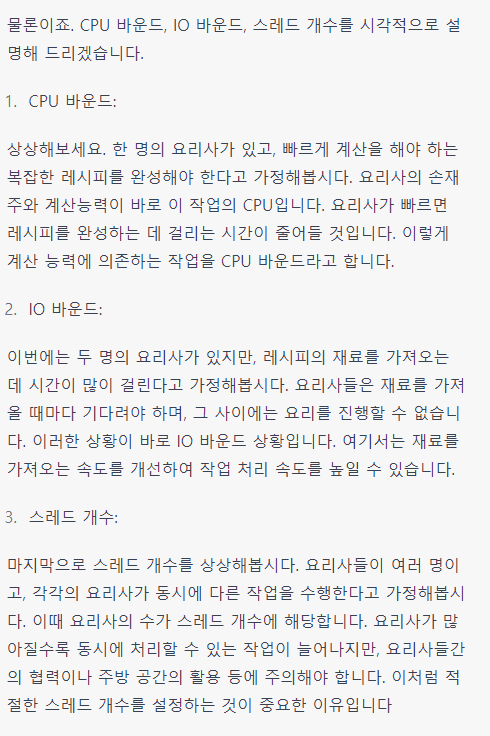

CPU : 프로세스의 명령어를 해석하고 실행하는 장치

IO : 파일을 읽고 쓰거나 네트워크의 어딘가와 데이터를 주고 받는 것, 입출력 장치와 데이터를 주고 받는 것

버스트 :  어떤 현상이 짧은 시간 안에 집중적으로 일어나는 일

CPU 버스트 : 프로세스가 CPU에서 한번에 연속적으로 실행되는 시간

IO 버스트 : 프로세스가 IO작업을 요청하고 그 결과를 기다리는 시간

프로세스 : CPU버스트 + IO버스트

CPU 바운드 (CPU-bound)란 주로 CPU 성능에 의존하는 프로세스나 작업을 의미합니다. 이러한 작업은 주로 계산이 많이 필요한 경우에 해당되며, CPU 성능이 좋을수록 작업 처리 속도가 빨라집니다.

IO 바운드 (IO-bound)는 주로 입출력(IO) 작업에 의존하는 프로세스나 작업을 의미합니다. 이러한 작업은 파일 처리, 네트워크 통신 등과 같은 외부 자원에 대한 액세스가 주요 요소입니다. IO 바운드 작업의 경우, 입출력 속도를 개선함으로써 작업 처리 속도를 높일 수 있습니다.

스레드 개수는 프로그램이 동시에 처리할 수 있는 작업의 단위를 나타냅니다. 멀티 스레딩은 여러 개의 스레드를 사용하여 동시에 여러 작업을 처리하는 기법입니다. 이를 통해 프로그램의 실행 속도를 개선하고 자원을 효율적으로 사용할 수 있습니다. 그러나 스레드 개수가 많아질수록 스레드 간의 동기화 및 자원 관리 등의 복잡성이 증가하므로, 적절한 스레드 개수를 설정하는 것이 중요합니다.

Goetz recommends : CPU bound 프로그램에서 적절한 스레드 수는 코어개수 + 1
