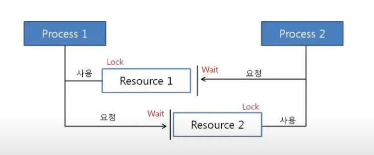

두 사람이 각각 장비 하나를 사용중

다른 장비도 써보고 싶지만 소심해서 기다리기만 함

사람이 프로세스 장비가 리소스

이로 인해 뒤에서 기다리는 사람들이 늦게 쓰거나 못쓸수 있음

즉 전체 시스템의 성능이 저하되거나, 시스템이 완전히 멈춤

데드락은 둘 이상의 스레드가 한정된 자원을 얻지 못해 다음 처리를 진행하지 못하는 상태

발생 조건 4가지 모두 만족시 발생

- 상호 배제 - mutual exclusion
    - 하나의 공유자원에 2개 이상의 프로세스가 동시에 접근할 수 없다
- 점유 대기 - hold and wait
    - 하나의 자원을 점유하고 있는 프로세스가 있고, 해당 프로세스가 다른 프로세스의 자원을 얻기 위해서는 요청을 하고 대기를 해야 한다
- 비선점 - no preemption
    - 특정 프로세스가 어떤 자원을 사용시 해당 자원 사용이 끝나기 전에는 다른 프로세스가 강제로 빼앗을수 없음
- 순환 대기 - circular wait
    - 프로세스들이 서로 사용하고 있는 자원에 대해서 순환적으로 대기

해결법

- 교착 상태 예방
    - 4가지 발생 조건 중 하나를 제거함으로써 해결 = 효율성이 떨어지고 비용이 많이듬
        - 상호 배제 - 하나의 자원을 둘 이상의 프로세스가 사용 (구현 가능?)
        - 점유 대기 - 작업 실행시 필요한 리소스를 전부 요청후 전부 할당받은다음 작업 시작 (작업 효율이 떨어짐, 프로세스가 필요로 하는 자원을 파악하는데 추가적인 오버헤드 발생)
        - 비선점 - 프로세스가 다른 프로세스의 자원을 요청하기 위해선 자신이 가지고 있던 자원을 반납해야함 (현재까지의 작업을 잃을 수 있음)
        - 순환 대기 - 각각의 자원에 고유번호 할당후 프로세스는 자신에게 할당받은 번호 기준으로 오름차순, 내림차순으로만 가능 (병목현상)
- 교착 상태 회피
    - 교착상태 발생 가능성을 검사해서 가능성이 있을시 사전 회피
        - 프로세스가 자원 요청시 자원 할당 후에도 안정상태로 남아있는지 사전 검사
        - 안정 상태라면 자원 할당
        - 불안정 상태라면 다른 프로세스가 자원을 해지할 때까지 대기
        - 자원 요청시마다 시스템 상태를 검사하기에 오버헤드가 큼
    - 자원 할당 그래프 알고리즘
    - 은행원 알고리즘 - 전제 조건 많음
- **교착 상태 탐지 및 회복** (주로 사용)
    - 교착 상태를 허용하지만 상태를 탐지하고 회복하는 방식
    - 알고리즘을 주기적인 실행하여 시스템에 발생한 Deadlock을 체크하고 회복
    - 교착 상태를 일으킨 프로세스를 종료하거나 할당된 자원을 해제하여 회복
    - 프로세스 종료
        - 교착 상태의 프로세스를 모두 중지
        - 교착 상테가 제거될 때까지 한 프로세스씩 중지
    - 자원 선점
        - 교착 상태가 제거될 때까지 프로세스가 점유한 자원을 선점해 다른 프로세스에 할당
    - 회복시 고려 사항
        - 희생자 선택 - 어떤 프로세스를 죽일지, 어떤 자원을 선점+다른 프로세스에 할당할지
            - 보통 비용적 측면에서 선택
            - 과할시 기아 상태 발생 - 걸린 프로세스가 또 걸림
            - 비용 측면만이 아닌 다양한 가중치를 고려해야함
        - 후퇴 - 희생자 선택시 해당 프로세스를 얼마나 롤백 시킬지
            - 재시작 or 롤백
        - 기아 상태
- 교착 상태 무시
    - 교착 상태를 무시하고 특별한 조치를 취하지 않음
    - 교착 상태의 발생 확률이 낮을시 주로 사용

    질문 답변

왜 예방이 효율이 떨어지고 비용이 많이드는가

1. 자원 사용의 비효율성 : 프로세스가 실행되기 전에 필요한 모든 자원을 한번에 할당하는것

이러면 순환 대기가 발생하지 않지만, 프로세스가 모든 자원을 미리 할당받기 때문에 

다른 프로세스가 사용할 수 있는 자원이 부족해지고, 전체적인 자원 사용 효율이 낮아짐

1. 처리 시간 증가 : 데드락 예방기법을 적용시 프로세스의 자원 요청과 할당을 

주의 깊게 관리해야함, 즉 추가적인 오버헤드가 발생하고 프로세스의 처리시간이 증가함

1. 데드락 예방을 위해 복잡한 알고리즘을 사용해야 할 수도 있음

이러한 알고리즘은 구현이 어렵고 프로그래밍 오류를 유발할 수 있으며

시스템 자원을 추가로 소모 할 수 있음

1. 상호 배제나 선점 불가 조건을 제거하기 위해 프로세스간 동기화를 강화시

병렬 처리 성능이 저하될 수 있음. 프로세스들이 동기화를 기다리는 동안 대기시간이 길어지고 

시스템 전체의 처리량이 감소할수 있음

2-1. 왜 오버헤드가 발생하는가 : 프로세스가 자원을 요청할때마다 시스템이 

데드락 발생 가능성을  확인해야함 = 자원 할당 상태, 프로세스의 자원 요청 정보등을 

추적 분석해야 함 = 오버헤드 발생

프로세스 처리 시간 증가 : 데드락을 예방하기 위해 시스템은 자원 요청을 지연시킬수 있음

예를 들어 위에서 말한 비효율성의 경우 모든 자원을 미리 요청해서 

점유와 대기조건을 제거하는데 이는 프로세스의 시작이 지연되고 처리 시간이 증가함

+

(4)상호 배제 조건을 제거하기 위해 프로세스들 간의 동기화를 강화시 동기화를 위한 비용 발생

동기화 메커니즘의 사용으로 인한 오버헤드와 프로세스들이 동기화를 기다리는 동안 발생하는 대기시간이 처리 시간을 증가시킴

(3)성능에 영향 : 복잡한 자원을 관리하기 위해 자원 할당 순서를 정하는 알고리즘을 사용할 수

있지만 효율적인 대신 구현이 복잡하고 시스템 성능에 영향을 끼침

요약하면 복잡한 연산과 동기화 비용때문

오버헤드 : 주 작업을 수행하는 데 직접적으로 관여하지 않지만, 그 작업을 가능하게 하거나, 효율적으로 수행하기 위해 필요한 간접적인 작업들에 소모되는 시간이나 리소스

예를 들어, 컴퓨터 프로그램이 실행되기 위해서는 메모리 할당, 자료구조 초기화, 입력 데이터 검증 등과 같은 추가적인 작업이 필요합니다. 이러한 작업들은 프로그램의 핵심 기능을 수행하는 데 직접적으로 기여하지 않지만, 프로그램 실행을 가능하게 하거나 효율적으로 수행하기 위해 필요한 부분입니다. 이처럼 주 작업과 별개로 발생하는 추가적인 비용이 오버헤드

자원 할당 그래프 알고리즘

[데드락(Deadlock) 개념 정리](https://kukuta.tistory.com/281)

은행원 알고리즘

[[운영체제]교착상태 회피-은행원 알고리즘(Banker's Algorithm) 쉬운 예시, 안전상태, 불안전상태](https://jhnyang.tistory.com/102)

기아상태 : 

기아 상태(Starvation)는 컴퓨터 시스템에서 특정 프로세스나 스레드가 공유 자원에 대한 접근이나 필요한 서비스를 오랜 시간 동안 받지 못해 일어나는 현상입니다. 기아 상태는 스케줄링 정책, 자원 할당 메커니즘, 동기화 등에 의해 발생할 수 있으며, 해당 프로세스나 스레드가 실행되지 못하고 계속 대기 상태에 머무르게 됩니다.

기아 상태는 다음과 같은 상황에서 발생할 수 있습니다:

1. 우선순위 기반 스케줄링: 우선순위가 낮은 프로세스가 계속해서 높은 우선순위의 프로세스들에 밀려 실행되지 못하는 경우 기아 상태가 발생할 수 있습니다.
2. 자원 경쟁: 여러 프로세스가 동시에 한정된 자원에 접근하려 할 때, 특정 프로세스가 자원을 할당받지 못하고 계속 대기하는 경우 기아 상태가 발생할 수 있습니다.
3. 데드락 회피 기법: 데드락을 회피하기 위해 사용되는 기법 중 일부는 특정 프로세스가 자원을 할당받지 못하게 함으로써 기아 상태를 발생시킬 수 있습니다.

기아 상태를 해결하려면 다음과 같은 방법을 사용할 수 있습니다:

1. 공정한 스케줄링 정책: 우선순위가 아닌 다른 기준을 사용하여 프로세스를 스케줄링하는 방식을 사용하거나, 우선순위를 동적으로 변경하여 모든 프로세스가 공정한 기회를 얻을 수 있게 합니다.
2. 자원 할당 알고리즘 개선: 기아 상태를 유발하는 자원 할당 알고리즘을 개선하여 프로세스 간의 경쟁을 완화하고, 공유 자원에 대한 접근을 공정하게 조절합니다.
3. 기아 탐지 및 회복 메커니즘: 시스템에서 기아 상태를 감지하고, 해당 프로세스에게 우선순위를 부여하거나 자원을 할당함으로써 기아 상태를 해결하는 메커니즘을 구현합니다.