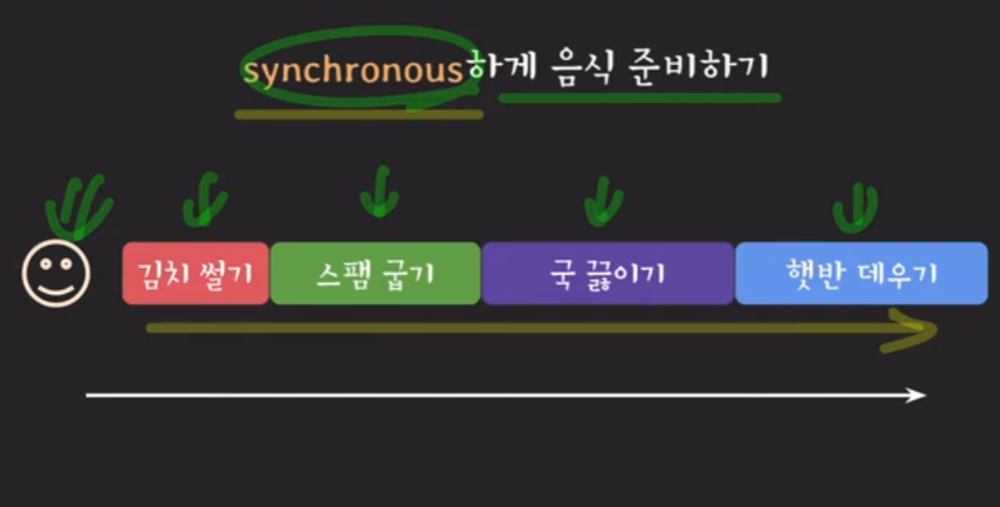
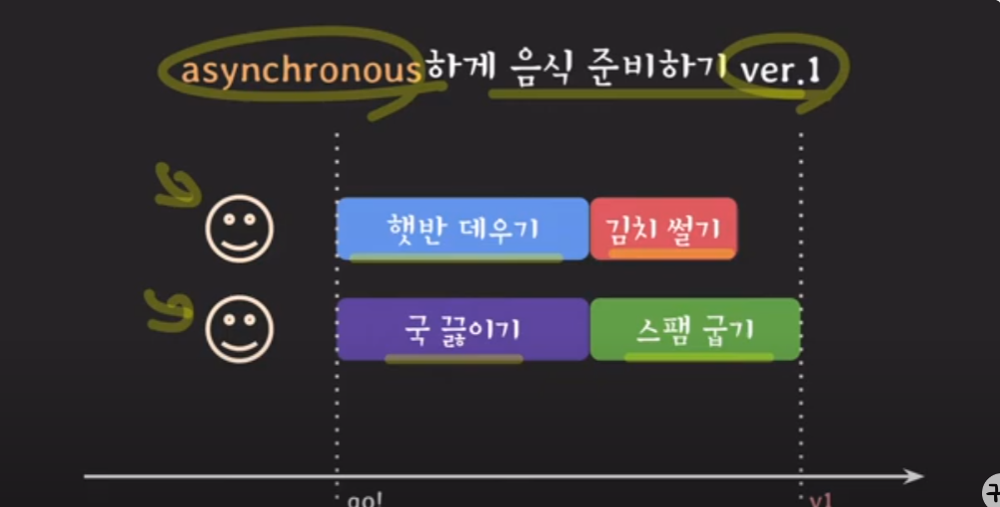
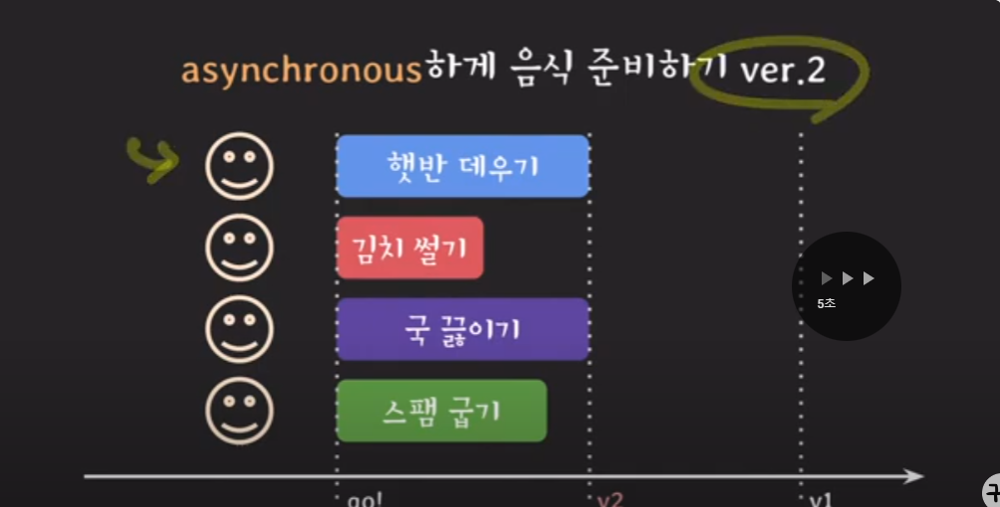
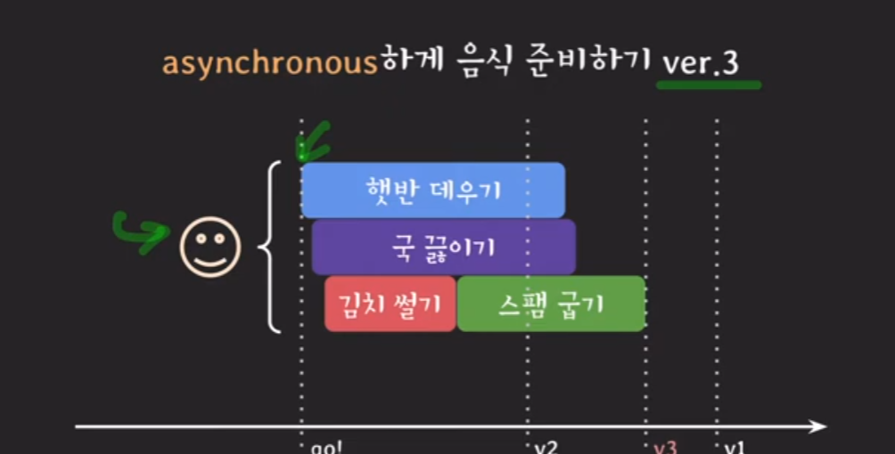
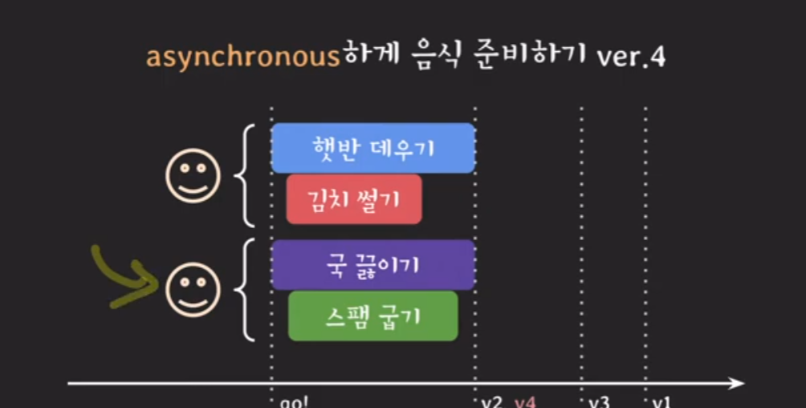

# Synchronous(동기)
    여러 작업들을 순차적으로 실행하도록 개발

# Asynchronous(비동기)
    여러 작업들을 독립적으로 실행하도록 개발

    Asynchronous != multithreding

    Asynchronous
     여러 작업을 동시에 실행하는 프로그래밍 방법론

    multithreding
     Asynchronous 의 한 종류
    
    이를 가능하게 하는건 multi-threads, non-block I/O

 

## 백엔드 프로그래밍의 추세는 스레드를 적게 쓰면서도 non-block I/O를 통해 전체 처리량을 늘리는 방향으로 발전 중
 
 

# OS 관점
## 1. synchronous I/O = block I/O, asynchronous I/O = non-block I/O
## 2. Synchronous I/O : 요청자가 I/O 완료까지 챙겨야 할 때, Synchronous I/O : 완료를 noti 주거나 callback으로 처리
## 3. asynchronous I/O : block I/O 를 다른 thread 에서 실행
 
 

# 백엔드 관점
## 하나의 서비스는 기능과 역활에 따라 여러 개의 마이크로 서비스로 구성되고 이들 사이에는 빈번하게 커뮤니케이션이 발생

    비동기 프로그래밍은 작업을 순차적으로 처리하는 대신에, 작업의 결과를 기다리지 않고 다른 작업을 처리할 수 있는 방식을 말합니다. 이렇게 하면 작업의 처리 시간이 길어져도 다른 작업을 처리하면서 시간을 절약할 수 있습니다.

    비동기 I/O는 입력과 출력 작업을 처리할 때, 입출력 작업이 완료될 때까지 기다리지 않고 다른 작업을 처리하는 방식을 말합니다. 이를 통해 입력과 출력 작업의 처리 속도를 높일 수 있습니다.

    비동기 커뮤니케이션은 프로세스나 스레드 간에 메시지 전달을 할 때, 메시지가 도착할 때까지 기다리지 않고 다른 작업을 처리할 수 있는 방식을 말합니다. 이를 통해 다른 작업을 처리하면서 메시지를 기다릴 필요 없이 효율적으로 작업을 수행할 수 있습니다. 