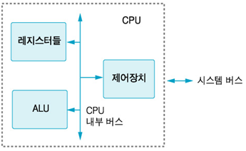
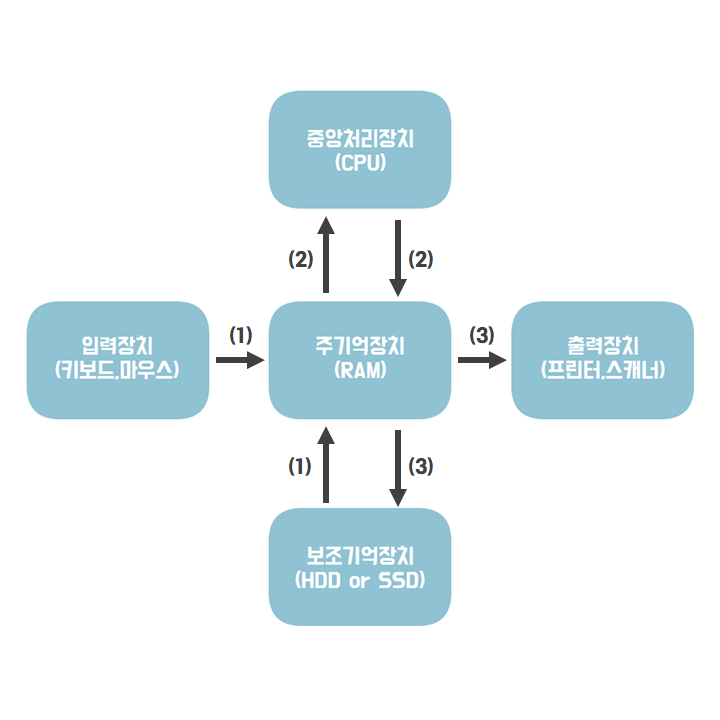
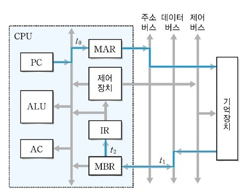
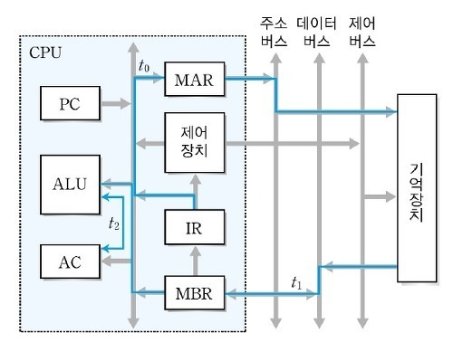

# 중앙처리장치(CPU)란?
`중앙처리장치(CPU)`는 명령어의 `해석`과 자료의 `연산`, `비교`등의 처리를 제어하는 컴퓨터 시스템의 핵심장치이다. 다양한 입력 장치로부터 정보를 입력받아 처리한 후, 그 결과를 출력장치로 보내는 일련의 과정을 `제어`하고 `조정`하는 일을 수행한다. CUP는 사람의 두뇌와 같이 컴퓨터의 모든 시스템을 제어, 처리하는 가장 핵심적인 장치라고 할 수 있다. 

<br>

## CPU 구성요소



CPU는 크게 `제어장치`, `연산장치(ALU)`, `레지스터`와 각 구성 요소를 연결하는 `내부 버스`로 구성되어 있다.

<br>

### 연산 장치
- 명령어를 실행하기 위한 마이크로연산(산술연산과 논리연산)을 수행
- 연산에 필요한 데이터를 레지스터에서 가져오고 산술, 논리, 관계, 이동 등 다양한 연산을 수행
- 연산 결과를 다시 레지스터로 보냄

<br>

### 제어 장치
- 명령어를 순서대로 실행할 수 있도록 제어하는 장치
- 주기억장치에서 프로그램 명령어를 꺼내 `해독`하고, 그 결과에 따라 명령어 실행에 필요한 `제어 신호`를 기억장치, 연산장치, 입출력장치로 보냄
- 또한 이들 장치가 보낸 신호를 받아 다음에 수행할 동작을 결정

<br>

### 레지스터
- CPU(중앙 처리 장치)내에 있는 소규모의 고속 기억장치
- 명령어 주소, 코드, 연산에 필요한 데이터 련산 결과 등을 임시로 저장
- 용도에 따라 범용 레지스터와 특수 목적 레지스터로 구분
- 레지스터는 메모리 계층의 `최상위`에 위치하며 `가장 빠른 속도`로 접근 가능한 메모리이다.
- 중앙처리장치 종류에 따라 사용할 수 있는 레지스터 개수와 크기가 다름
    - 범용 레지스터 : 연산에 필요한 데이터나 연산 결과를 임시로 저장
    - 특수목적 레지스터 : 특별한 용도로 사용하는 레지스터

<br>

### 특수 목적 레지스터의 종류
- MAR (메모리 주소 레지스터) : `읽기`와 `쓰기` `연산`을 수행할 주기억장치 주소를 저장
- PC (프로그램 카운터) : 다음에 실행될 `명령어의 주소`를 저장
- SP (스택 포인터) : `스택`의 최상위 주소를 저장
- IX (인덱스 레지스터) : 인덱스 주소 지정 방식에서 `인덱스`를 저장
- IR (명령어 레지스터) : 명령어를 호출해서 해독하기 위해 `현재 명령어`를 임시로 저장
- MBR (메모리 버퍼 레지스터) : `주기억장치의 내용`을 임시로 저장하는 역할
- AC (누산기) : 산술 논리 장치의 `연산 결과`를 임시로 저장
- PSR (프로그램 상태 레지스터) : `CPU의 현재 상태 정보`를 저장

<br>

## CPU 연산&동작 과정

### 연산

CPU의 연산 순서는 `Fetch`->`Decode`->`Execute`->`Writeback`으로 이루어지며 각 과정의 설명은 다음과 같다.
- Fetch(`인출`): 메모리상의 프로그램 카운터(PC)가 가리키는 명령어를 CPU가 가르키는 명령어를 CPU로 인출하여 적재
- Decode(`해석`): 명령어의 해석. 이 단계에서 명령어의 종류와 타겟 등을 판단한다.
- Execute(`실행`): 해석된 명령어에 따라 데이터에 대한 연산을 수행한다.
- Writeback(`쓰기`): 명령어대로 처리 완료된 데이터를 메모리에 기록한다.

<br>

### 동작 과정


(1) 보조기억장치에서 저장된 프로그램을 읽거나, 입력장치에서 입력받은 데이터를 주기억장치에서 읽는다.<br>
(2) 주기억장치에서 읽어온 데이터를 중앙처리장치(CPU)가 읽고 처리한 후 다시 주기억장치로 보낸 후 저장한다.<br>
(3) 주기억장치는 연산된 데이터를 출력장치에 보내거나 보조기억장치에 저장한다.<br>
(4) 제어장치는 (1)-(3)과정에서 명령어가 순서대로 잘 실행되도록 제어하는 역할을 수행.<br>

<br>

## CPU의 명령어

### 명령어 세트
- 명령어 세트는 CPU가 실행할 명령어의 집합이다.
- 명령어 세트는 실행할 연산을 나타내는 `연산 코드(Operation Code)`와 연산에 필요한 데이터나 데이터의 저장 위치를 나타내는 `피연산자(Operand)`로 구성된다.

<br>

### 연산 코드 (Operation Code)

연산 코드는 실행하는 연산의 종류에 따라 다음과 같이 네 가지 기능으로 나뉜다.

- 연산 기능 : 사칙연산, 이동(shift), 보수 등의 산술연산과 논리곱, 논리합, 부정 등의 논리연산을 수행한다.
- 제어 기능 : 조건 분기와 무조건 분기 등을 사용하여 명령어의 실행 순서를 제어한다.
- 데이터 전달 기능 : 레지스터와 레지스터 사이, 레지스터와 주기억장치 사이에서 데이터를 전달한다.
- 입출력 기능 : 프로그램과 데이터를 주기억장치에 전달하고, 연산 결과는 출력장치에 전달한다.

<br>

### 피연산자 (Operand)

피연산자에는 주소, 숫자/문자, 논리 데이터 등을 저장할 수 있다.

- 주소 : 기억장치 혹은 레지스터의 주소가 저장된다.
- 숫자/문자 : 숫자는 정수, 고정 소수점 수, 부동 소수점 수 및 각각의 코드로 저장되고 문자는 아스키코드로 저장된다.
- 논리 데이터 : 참 또는 거짓을 표현할 때 사용하며 비트나 플래그로 저장된다.

<br>

## 명령어 사이클

CPU에서는 프로그램을 실행하기 위해 주기억장치에서 명령어를 순차적으로 `인출`하여 `해독`하고 `실행`하는 과정을 반복하는데, CPU가 `주기억장치에서 한 번에 하나의 명령어를 인출하여 실행하는데 필요한 일련의 활동`을 `명령어 사이클 (Instruction Cycle)`이라고 한다.

명령어 사이클은 `인출` 사이클, `실행` 사이클, `간접` 사이클, `인터럽트` 사이클로 세분화 시킬 수 있는데, `인출 사이클과 실행 사이클은 항상 수행`되지만 / `간접 사이클과 인터럽트 사이클은 주소 지정방식이 필요할 때나 인터럽트 요구가 있을 때만` 수행된다.

<br>

### 인출사이클과 특수 목적 레지스터의 동작 과정



- 프로그램 카운터(PC)에 저장된 주소를 메모리 주소 레지스터(MAR)로 전달 한다.
- 메모리 주소 레지스터(MAR)에 저장된 내용을 토대로 주기억장치의 해당 주소에서 명령어를 인출한다.
- 인출한 명령어를 메모리 버퍼 레지스터(MBR)에 저장한다.
- 다음 명령어를 인출하기 위해 프로그램 카운터 (PC)의 값을 증가 시킨다.
- 메모리 버퍼 레지스터(MBR)에 저장된 내용을 명령어 레지스터(IR)에 전달한다.

위 과정을 다음과 같이 표현하기도 한다.
```text
T0 : MAR <- PC
T1 : MBR <- M[MAR], PC <- PC + 1
T2 : IR <- MBR
```

<br>

### 실행 사이클과 특수 목적 레지스터의 동작 과정

다음은 인출 사이클로부터 명령어를 인출한 이후 명령어를 실행하는 과정인 실행 사이클의 과정이다.
그 중에서도 더하기(ADD) 연산으로 과정을 살펴보자.



- 명령어 레지스터(IR)의 내용을 메모리 주소 레지스터(MAR)로 전달한다.
- 메모리에 저장된 데이터 값을 메모리 버퍼 레지스터(MBR)에 저장한다.
- 누산기(AC)에 저장된 값에 ADD연산을 실행한다.

실행 사이클도 인출 사이클과 마찬가지로 다음과 같이 표현 할 수 있다.
```text
ADD addr 명령어 연산

T0 : MAR <- IR(Addr)
T1 : MBR <- M[MAR]
T2 : AC <- AC + MBR
```

<br>

### 실행 사이클에서는 프로그램 카운터를 증가시키지 않는 이유<br>
인출 사이클과 다르게 실행 사이클에서는 프로그램 카운터(PC)를 증가시키지 않는데, `이미 인출이 진행 되고 명령어 실행만 하면 되는 상황`이기 때문에 프로그램 카운터를 증가시킬 필요가 없다.
즉, 이미 인출이 되어 명령어 레지스터(IR)에 메모리 버퍼 레지스터(MBR)의 값이 저장된 상태라는 의미이다.