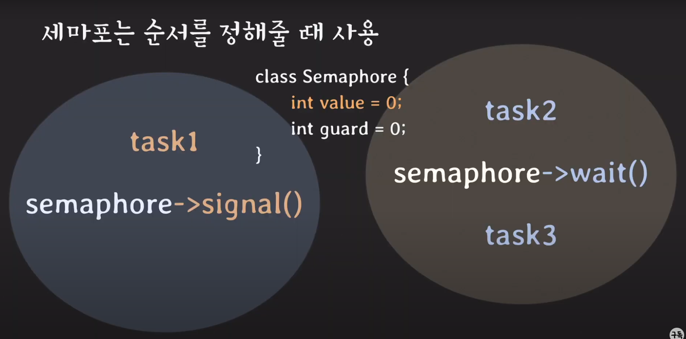

## 용어 복습
- race condition(경쟁 조건)  
여러 프로세스/스레드가 동시에 같은 데이터를 조작할 떄 타이밍이나 접근 순서에 따라 경과가 달라질 수 있는 상황

- synchronization(동기화)  
여러 프로세스/스레드를 동시에 실행해도 공유 데이터의 일관성을 유지하는 것

- critical section(임계 영역)
공유 데이터의 일관성을 보장하기 위해 **하나의 프로세스/스레드만 진입해서 실행** 가능한 영역

- mutual exclusion  
하나의 프로세스/스레드만 진입해서 실행

<hr>

# 스핀락
lock 을 얻을 때까지 계속 요청 (CPU atomic 명령어의 도움을 받아서 동시에 요청 못함)

```c#
volatile int lock = 0;

void criticla(){
    while(test_and_set(&lock)== 1);
    // critical section 작업
    lock = 0;
}

int test_and_set(int* lockPtr){
    int oldLock = *lockPtr;
    *lockPtr = 1;
    return oldLock;
}

```

### 단점
기다리는동안 CPU를 낭비한다

<hr>

# 뮤텍스
기다리는동안 재워놓음

```c#
class Mutex{
    // 작업중인 스레드가 있는지 확인하는 장치
    int value = 1;

    // critical section 안에서 안전하게 작동하도록 보호하는 장치
    int guard = 0;
}

Mutex::lock(){
    while(test_and_set(&guard));
    if(value == 0){
        // 스레드에 큐를 넣음;
        guard = 0; // go to sleep
    } else {
        value = 0;
        guard = 0;
    }
}

Mutex::unlock(){
    while(test_and_set(&guard));
    if(waiting_que){
        wake(waiting_que);
    } else {
        value = 1;
    }
    guard = 0;
}

mutex -> lock();
// critical section
mutex -> unlock();

```

### 항상 스핀락보다 좋은가?

>멀티코어 환경이고, criticla section에서의 작업이 컨텍스트 스위칭보다 더 빨리 끝난다면 스핀락이 뮤텍스보다 이점이있다.

WHY?
>1번코어에서 작업중일경우, 2번코어에서 대기하다가 컨텍스트스위칭없이 2번코어에서 바로 실행 가능


<hr>

# semaphore(세마포)
signal mechanism을 가진, 하나이상의 프로세스/스레드가
critical section에 접근 가능하도록 하는 장치

```C#
class Semaphore{
    // 작업중인 스레드가 있는지 확인하는 장치
    int value = 1; // 1 이상의 정수 가능 ( 공유자원의 수만큼 )

    // critical section 안에서 안전하게 작동하도록 보호하는 장치
    int guard = 0;
}

Mutex::lock(){
    while(test_and_set(&guard));
    if(value == 0){
        // 스레드에 큐를 넣음;
        guard = 0; // go to sleep
    } else {
        value -= 1;
        guard = 0;
    }
}

Mutex::unlock(){
    while(test_and_set(&guard));
    if(waiting_que){
        wake(waiting_que);
    } else {
        value += 1;
    }
    guard = 0;
}

mutex -> lock();
// critical section
mutex -> unlock();
```

## 세마포는 시그널 매커니즘을 가진다.

task3 은 항상 task1의 작업이 끝난 뒤에 실행됨
-> 순서를 정할 수 있음


## mutex 와 binary semaphore는 같은가
|뮤텍스|이진 세마포|
|---|---|
|락을 가진자만 해제 가능| 아님|
|priority inheritance속성을 가진다| 안가진다|
|상호 배제만 필요할 때|작업간의 실행순서 동기화가 필요할 때|