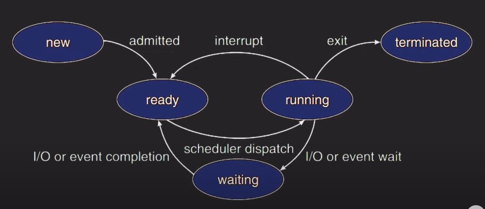

## 자바 스레드 상태 종류
- NEW  
자바 스레드가 아직 시작하지 않은 상태

- RUNNABLE  
실행중인 상태

- BLOCKED  
critical section으로 들어가려고 모니터 락을 얻기위해 기다리는 상태

- WAITING  
다른 스레드를 기다리는 상태

- TIMED_WAITING  
제한 시간을 두고 다른 스레드를 기다리는 상태 

- TERMINATED  
실행을 마치고 종료된 상태


스레드 변화
```java
class BoundedBuffer{
    private final int[] buffer = new int[5];
    private int count = 0;

    public synchronized void produce(int item){
        while(count==5) wait();
        buffer[count++] = item;
        notifyAll();
    }

    public vlid consume(){
        int item = 0;
        synchronized(this){
            while(count==0)wait();
            item = buffer[--count];
            notifyAll();
        }
        System.out.println("Consume : " + item);
    }
}

public class Main{
    public static void main(String[] args) throws{
        BoundedBuffer buffer = new BoundedBuffer();

        Thread consumer = new Thread(() -> {
            buffer.consume();
        });

        Thread producer = new Thread(() -> {
            buffer.produce();
        });

        consumer.start();
        producer.start();

        consumer.join();
        producer.join();
        System.out.println("완료");
    }
}

```


### thread dump
실행 중인 자바 프로세스의 현재 상태를 담은 스냅샷
