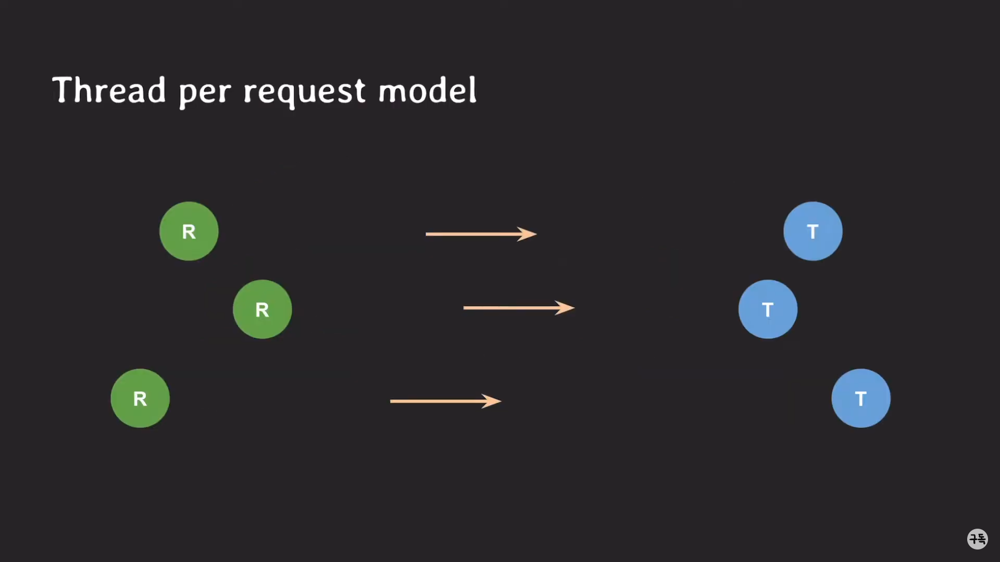
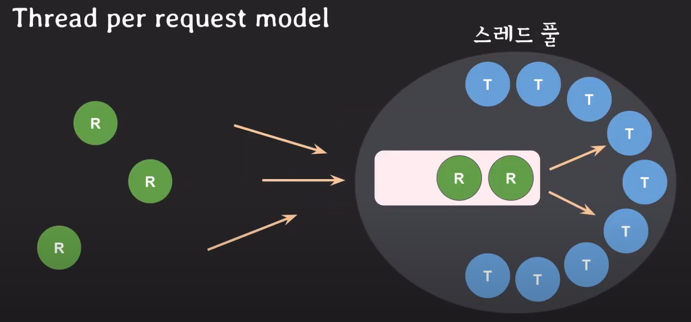

# 스레드 풀 (Thread pool)

thread pool을 사용하는 경우
>여러 작업을 동시에 처리해야할 때
1. thread per request 모델
2. task를 subtask로 나뉘어서 동시에 처리
3. 순서에 상관 없이 동시 실행이 가능한 task처리

<hr>

## Thread per request model
서버의 api 요청을 처리하는 방법중 하나



### 요청마다 스레드를 생성하게 된다면?

- 스레드 생성에 많은 시간을 소요 할 수 있다.

- 처리속도가 요청이 들어오는 속도를 못따라 갈 경우
>스레드가 많아진다. ->   
컨텍스트 스위칭이 자주 발생한다 ->   
CPU 오버헤드 증가로 CPU time 낭비한다. ->   
서버 전체가 응답 불가능 상태에 빠진다.

<br>



미리 스레드를 여러개 만들어 놓고 재사용
스레드 생성 시간 절약

제한된 개수의 스레드를 운용
스레드가 무제한으로 생성되는 것을 방지

<hr>

## 스레드 풀의 적정 스레드 수
- CPU bound task
코어 수와 비슷하게 설정

- I/O bound task
1.5배, 2배, 3배 등이 가능하지만 성능테스트를 통해 최적의 스레드 수를 결정하는 것이 좋다.


<hr>


## 스레드풀 의 큐 사이즈
만약 큐 사이즈의 제한이 없다면 Out of Memory (OOM) 오류 발생할수 있다.

>Out of Memory (OOM)   
>큐에 대기 중인 작업이 많을 때, 메모리에 너무 많은 작업이 쌓이면 메모리 부족으로 인해 OOM 오류가 발생할 수 있습니다.


<hr>


## 코드예제
[파이썬 공식문서](https://docs.python.org/3/library/concurrent.futures.html?highlight=threadpoolexecutor#concurrent.futures.ProcessPoolExecutor)
```python
import concurrent.futures

executor = ThreadPoolExecutor(max_workers=7)
task1_future = executor.submit(task1)
task2_future = executor.submit(task2)
...

```
max_workers가 제공되거나 제공 None되지 않으면 기본적으로 시스템의 프로세서 수가 사용됩니다.
