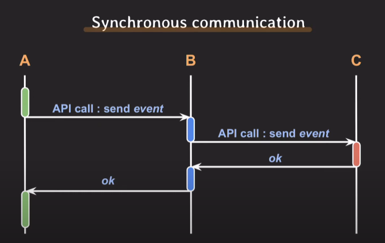
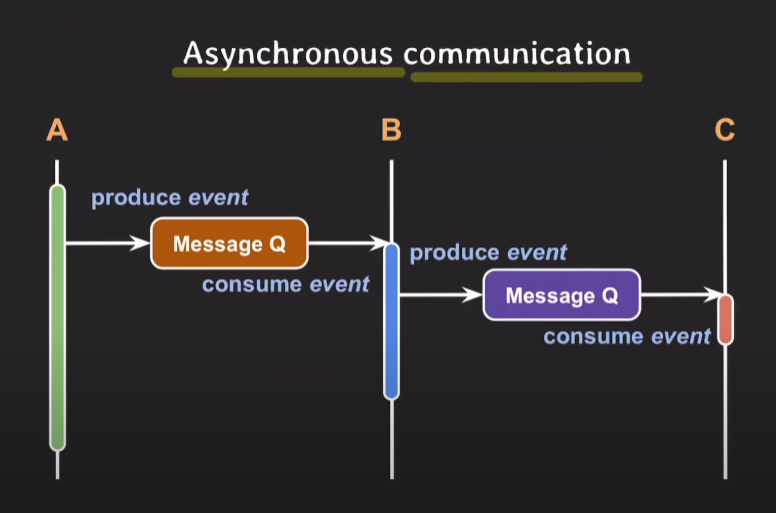

# asynchronous programming
## 프로그래밍 관점에서

- multi-thread
다중 스레드를 통한 동시 실행 

- non-block I/O
CPU작업과 IO작업은 동시에 할 수 있다.

이 두가지를 잘 섞어서 효율적인 작업 순서를 설정하는 것

## I/O 관점에서

1. case1
>synchronous I/O = block I/O   
>asynchronous I/O = non-blick I/O

2. case2
>synchronous I/O = 요청자가 I/O 완료까지 챙겨야 할 때   
>asynchronous I/O = 완료를 noti 주거나 callback으로 처리

3. case3
>asynchronous I/O = block I/O를 다른 thread에서 실행

## 벡엔드 아키텍처 관점에서

Synchronous communication

api를 호출하고 Response가 있을 때까지 Block상태로 전환함

Asynchronous communication

Que에 메세지를 담거나, 메세지가 있는지 계속 확인하면서 서로 따로 작업함