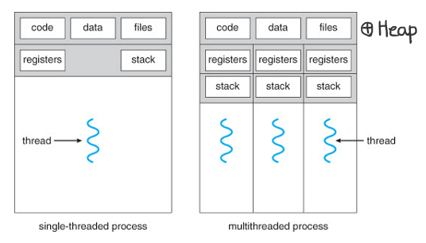

# 기본 용어들

### 프로그램
컴퓨터가 실행할 수 있는 명령어들의 집합

### Process(프로세스)
컴퓨터에서 실행중인 프로그램   
각각의 프로세스는 __독립된 메모리 공간__ 을 할당 받음
명령어들과 데이터를 가짐

### CPU
명령어를 실행하는 연산장치

### Main Memory(메인 메모리)
프로세스가 CPU에서 실행되기 위해 대기하는 곳

### I/O (input/output)
파일을 읽고 쓰거나
네트워크의 어딩가와 데이터를 주고 받는 것
입출력 장치와 데이터를 주고 받는것

---

# PROCESS의 역사

## 단일 프로세스 시스템

| 정의 | 단점 | 해결법 |
| --- | --- | ---|
|한번에 하나의 프로그램|CPU 사용률이 좋지 않음 |_여러 개의 프로그램_ 을 메모리에 올려놓고 동시에 실행시키자!  IO 작업이 발생하면 다른 프로세스가 CPU에서 실행됨|

## 멀티프로그래밍

| 정의 | 단점 | 해결법 |
| --- | --- | ---|
|CPU 사용률을 극대화 시키는데 목적|CPU 사용시간이 길어지면 다른 프로세스는 계속 대기|프로세스는 한번 CPU를 사용할 때  아주 짧은 시간(=Quantum)만 CPU에서 실행 되도록 하자!|

---

## 멀티태스킹
프로세스의 응답 시간을 최소화 시키는데 목적

### 단점
1. 하나의 프로세스가 동시에 여러 작업을 수행하지는 못함

2. 프로세스의 컨텍스트 스위칭(프로세스 교체)은 무거운 작업

3. 프로세스끼리 데이터 공유가 까다로움   
메모리 공간이 서로 독립적

듀얼 코어가 등장해버림

---

## Thread(스레드)

### 특징
1. 프로세스는 한 개 이상의 스레드 가질 수 있다.
2. CPU에서 실행되는 단위(unit of execution)
3. 같은 프로세스의 스레드들끼리 컨텍스트 스위칭은 가볍다.
4. 스레드들은 자신들이 속한 프로세스의 메모리 영역을 공유

---

## 멀티스레딩
하나의 프로세스가 동시에 여러 작업을 실행하는데 목적(스레드들을 이용)

### 멀티 태스킹 개념의 확장
여러 프로세스와 여러 스레드가 아주 짧게 쪼개진 cpu time을 나눠 갖는 것

---

## Multiprocessing(멀티 프로세싱)
두 개 이상의 프로세서나 코어를 활용하는 시스템

---