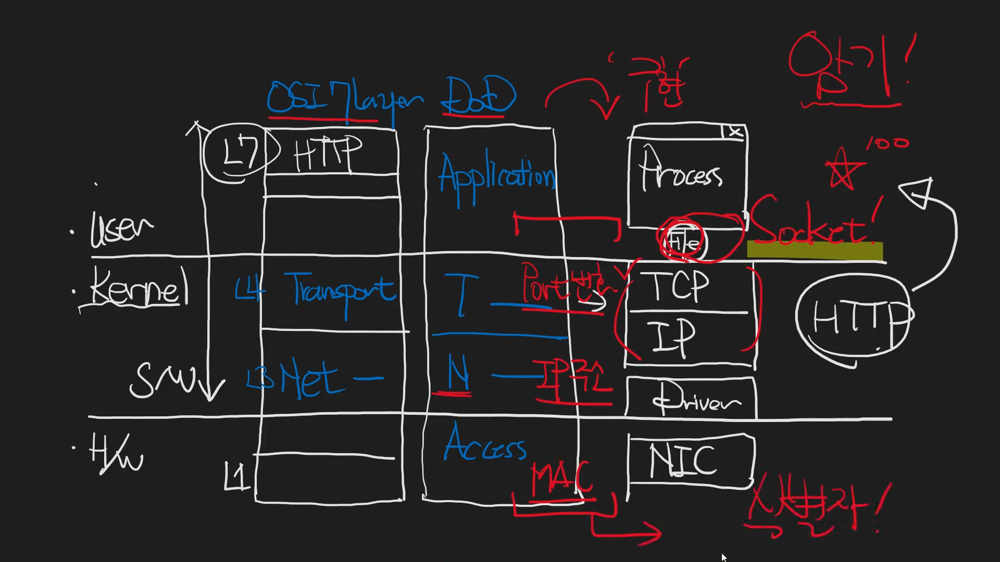

# 네트워크
공부하지마라

| 개념 | 사실 |
| --- | --- |
| 사람 | 최호성 |
|OSI 7 Layer | TCP/IP + HTTP|

## 소켓
TCP/IP를 유저모드 application process가 접근할 수 있도록 파일형태로 추상화한 것

## OSI 7 Layer
|  | OSI 7 Layer |
| --- | --- |
| User | L7   L6   L5 |
| --- | --- |
| Kernel | L4 ( Transport )   L3 ( Network ) |
| --- | --- |
| H/W | L2   L1 |

## DOD

|  | DOD |
| --- | --- |
| User | Application |
| --- | --- |
| Kernel | Transport   Network |
| --- | --- |
| H/W | Access |

## 구현

|  | 구현 |
| --- | --- |
| User | Process   File(Socket) |
| --- | --- |
| Kernel | TCP/IP   Driver |
| --- | --- |
| H/W | NIC |